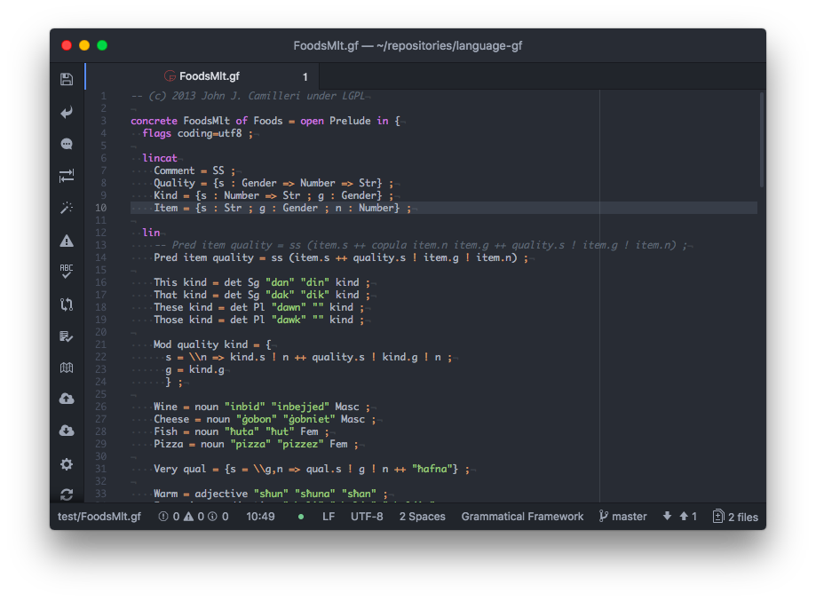
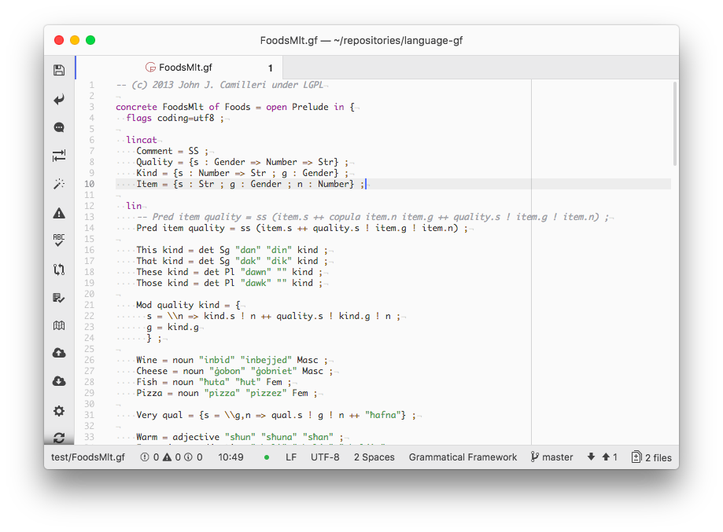

# Grammatical Framework language support in Atom

Adds syntax highlighting for GF grammar files in Atom.

Contributions are greatly appreciated.
Please fork this repository and open a pull request with your improvements.
